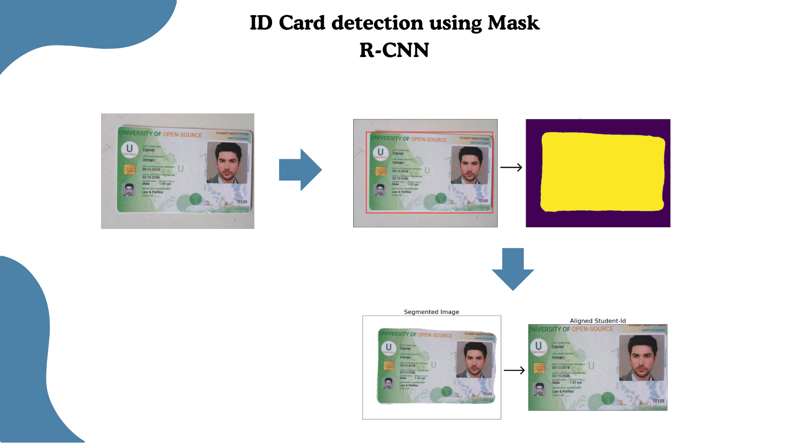

# ID Card Detection using Mask R-CNN.png

 

  

<!-- TABLE OF CONTENTS -->

  

  
Table of Contents

  <ol>
    <li>
      <a href="#about-the-project">About The Project</a>
      <ul>
        <li><a href="#built-with">Built With</a></li>
      </ul>
    </li>
    <li><a href="#dataset">Dataset</a></li>
    <li><a href="#how-to-works">How to Works</a></li>
    <li><a href="#next-step">Next Step</a></li>
    <li><a href="#license">License</a></li>
    <li><a href="#reference">Reference</a></li>
  </ol>
  

<!-- ABOUT THE PROJECT -->
## About The Project

This project is one part of the information extraction process in image documents. According to the image below, this project can be used for the second process, namely Document Detection.

  

This project leverages transfer learning via fine-tuning the state of art object segmentation algorithm Mask R-CNN backboned by pre-trained ResNet-50 available in torchvision models gallery.

Formats of targets expected by the model are
- **Boxes** (FloatTensor[N, 4]): the ground-truth boxes in [x1, y1, x2, y2] format, with values of x between 0 and W and values of y between 0 and H.
- **Masks** (UInt8Tensor[N, H, W]): the segmentation binary masks for each instance.

After getting the two formats, we can crop the image based on masks of the image/documents.

  

**Note:** This project is still in Jupyter Notebook. The next step is to carry out the packaging and deploying code process.

### Built With

These are list any major frameworks/libraries used to make the project.

* [![Pytorch][Pytorch]][Pytorch-url]

## Dataset
The data used is [KTP data from Roboflow](https://universe.roboflow.com/fauzan-ihza-fajar/ktp-j9mig).

## How to Works
Mask R-CNN is a deep learning model that combines object detection and instance segmentation. It is an extension of the Faster R-CNN architecture.

The key innovation of Mask R-CNN lies in its ability to perform pixel-wise instance segmentation alongside object detection. This is achieved through the addition of an extra "mask head" branch, which generates precise segmentation masks for each detected object. This enables fine-grained pixel-level boundaries for accurate and detailed instance segmentation.

Two critical enhancements integrated into Mask R-CNN are ROIAlign and Feature Pyramid Network (FPN). ROIAlign addresses the limitations of the traditional ROI pooling method by using bilinear interpolation during the pooling process. This mitigates misalignment issues and ensures accurate spatial information capture from the input feature map, leading to improved segmentation accuracy, particularly for small objects.

FPN plays a pivotal role in feature extraction by constructing a multi-scale feature pyramid. This pyramid incorporates features from different scales, allowing the model to gain a more comprehensive understanding of object context and facilitating better object detection and segmentation across a wide range of object sizes.

  

## Next Step 
In the next step, we can carry out the packaging and deploying code to be implemented in the production environment.

## License
MIT

## Reference
[1] [What is Mask R-CNN?](https://blog.roboflow.com/mask-rcnn/)

[2] [Pytorch for Information Extraction on Image Documents](https://mbassijaphet.github.io/pytorch-for-information-extraction/introduction)

(<a href="#automed-forecasting">back to top</a>)

<!-- MARKDOWN LINKS & IMAGES -->
<!-- https://www.markdownguide.org/basic-syntax/#reference-style-links -->
[Pytorch]: https://img.shields.io/badge/PyTorch-EE4C2C?style=for-the-badge&logo=pytorch&logoColor=white
[Pytorch-url]: https://pytorch.org/